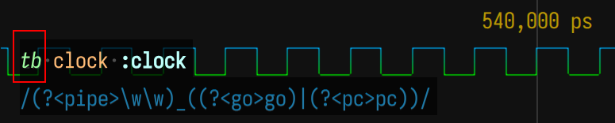
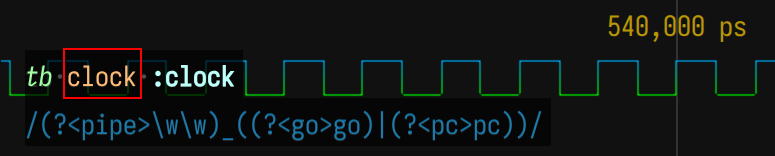
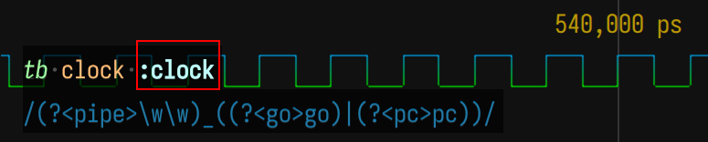
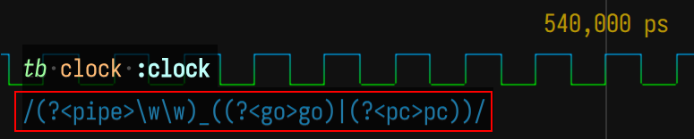
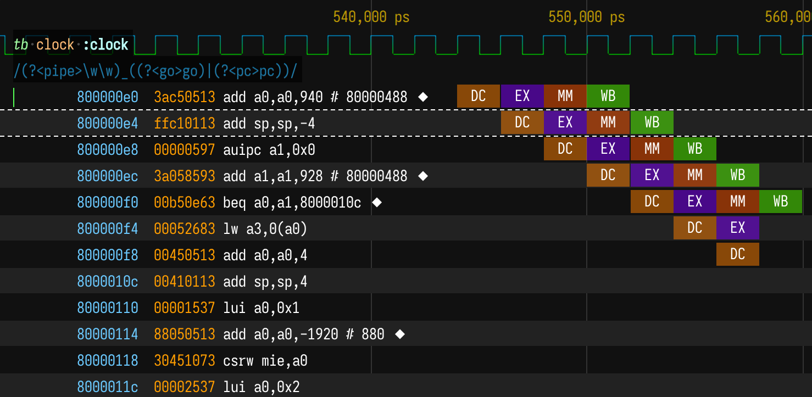

## Pipeline Viewer Demo

Click the link below to open demo in VCDrom Online >>>

https://wavedrom.live/?github=wavedrom/vcd-samples/trunk/Briey/dump1.vcd.br&github=wavedrom/vcd-samples/trunk/Briey/dump.waveql&github=wavedrom/vcd-samples/trunk/Briey/demo.lst

3 files needed for Pipeline View:
* `.vcd` - of simulation dump with pipeline probes
* `.waveql` - Waveform Query (signal list) file with correct DIZ RegExp
* `.lst` - Assembly listing from Object Dump

### Inserting Pipeline Probes into Verilog

https://github.com/wavedrom/vcd-samples/blob/trunk/Briey/tb.sv#L26

A pair of signals per pipeline stage:
* `<STAGE>_pc` - PC of instruction executed by the stage
* `<STAGE>_go` - valid bit when stage is active

```verilog
// Pipeline Probes
wire [31:0] dc_pc = axi_core_cpu.decode_PC;
wire [31:0] ex_pc = axi_core_cpu.execute_PC;
wire [31:0] mm_pc = axi_core_cpu.memory_PC;
wire [31:0] wb_pc = axi_core_cpu.writeBack_PC;

wire dc_go = axi_core_cpu.decode_arbitration_isValid;
wire ex_go = axi_core_cpu.execute_arbitration_isValid;
wire mm_go = axi_core_cpu.memory_arbitration_isValid;
wire wb_go = axi_core_cpu.writeBack_arbitration_isValid;
```

### How to build and simulate

CPU design is from:

https://github.com/SpinalHDL/VexRiscv


Command to build software:

https://github.com/SpinalHDL/VexRiscvSocSoftware/tree/master/projects/murax/demo

fixes:

```diff
diff --git a/resources/gcc.mk b/resources/gcc.mk
index 597f0ba..a9332a2 100644
--- a/resources/gcc.mk
+++ b/resources/gcc.mk
@@ -21,6 +21,7 @@ endif
 ifeq ($(COMPRESSED),yes)
        MARCH := $(MARCH)ac
 endif
+MARCH := $(MARCH)_zicsr

 CFLAGS += -march=$(MARCH)  -mabi=$(MABI)
 LDFLAGS += -march=$(MARCH)  -mabi=$(MABI)
```

```diff
diff --git a/resources/subproject.mk b/resources/subproject.mk
index 3aba0d6..b7458b9 100755
--- a/resources/subproject.mk
+++ b/resources/subproject.mk
@@ -1,15 +1,15 @@

-all: $(OBJDIR)/$(PROJ_NAME).elf $(OBJDIR)/$(PROJ_NAME).hex $(OBJDIR)/$(PROJ_NAME).asm $(OBJDIR)/$(PROJ_NAME).v
+all: $(OBJDIR)/$(PROJ_NAME).elf $(OBJDIR)/$(PROJ_NAME).hex $(OBJDIR)/$(PROJ_NAME).asm $(OBJDIR)/$(PROJ_NAME).lst $(OBJDIR)/$(PROJ_NAME).v

 $(OBJDIR)/%.elf: $(OBJS) | $(OBJDIR)
        $(RISCV_CC) $(CFLAGS) -o $@ $^ $(LDFLAGS) $(LIBS)
@@ -49,22 +49,25 @@ $(OBJDIR)/%.elf: $(OBJS) | $(OBJDIR)

 %.bin: %.elf
        $(RISCV_OBJCOPY) -O binary $^ $@

 %.v: %.elf
        $(RISCV_OBJCOPY) -O verilog $^ $@


 %.asm: %.elf
        $(RISCV_OBJDUMP) -S -d $^ > $@

+%.lst: %.elf
+       $(RISCV_OBJDUMP) --source --all-headers --demangle --line-numbers --wide $< > $@
+
 $(OBJDIR)/%.o: %.c
        mkdir -p $(dir $@)
        $(RISCV_CC) -c $(CFLAGS)  $(INC) -o $@ $^

@@ -79,9 +82,7 @@ clean:
        rm -f $(OBJDIR)/$(PROJ_NAME).map
        rm -f $(OBJDIR)/$(PROJ_name).v
        rm -f $(OBJDIR)/$(PROJ_NAME).asm
+       rm -f $(OBJDIR)/$(PROJ_NAME).lst
        find $(OBJDIR) -type f -name '*.o' -print0 | xargs -0 -r rm

 .SECONDARY: $(OBJS)

```

Command to build CPU:

```
sbt "runMain vexriscv.demo.BrieyWithMemoryInit"
```


### Run Simulation

Create named pipe for the vcd dump:

```bash
mkfifo dump1.vcd
```

Connect Brotli compressor to the named pipe:

```bash
brotli -q 9 < dump1.vcd > dump1.vcd.br
```

Command to run simulation:

```bash
iverilog -g2005-sv -o sim Briey.v tb.sv && vvp sim +duration=100000 +vcdname=dump1.vcd
```

## Understanding WaveQL file

First we enter `tb` testbench level



Next we select `clock` signal at current hierarchical level.



Then we give a symbolic label to a current signal `:clock`.



Next we call use "RegExp" with "pipe/pc/go" pattern to select set of signals.
All matches will be grouped into pairs pf `pc` / `go` signal with unique `pipe` name.



Below you will see all pipeline stage bricks that was found in this time frame and associated listing lines. Names of pipeline bricks are UpperCase `pipe`s from your signal names. Colors picked randomly.


