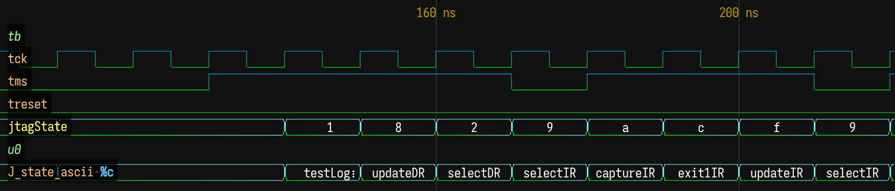
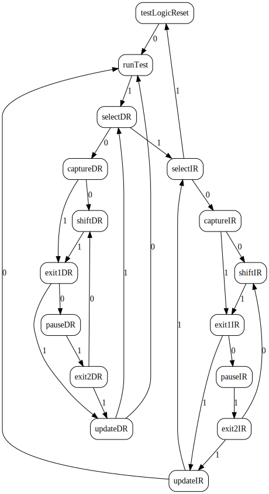

# JTAG FSM

## Run Simulation

```bash
iverilog -o sim jtag.v tb.v && vvp sim
```

https://wavedrom.live/?github=wavedrom/vcd-samples/trunk/jtag/jtag.vcd&github=wavedrom/vcd-samples/trunk/jtag/jtag.waveql

One way of putting string into waveforms is to encode them as a vector of characters.

```verilog
reg [111:0] J_state_ascii;
always @(*)
  case ({J_state})
    J_testLogicReset : J_state_ascii = "testLogicReset";
    J_runTest        : J_state_ascii = "runTest       ";
    J_selectDR       : J_state_ascii = "selectDR      ";
    ...
  endcase
```

Then use WaveQL `%c` format to decode them.




